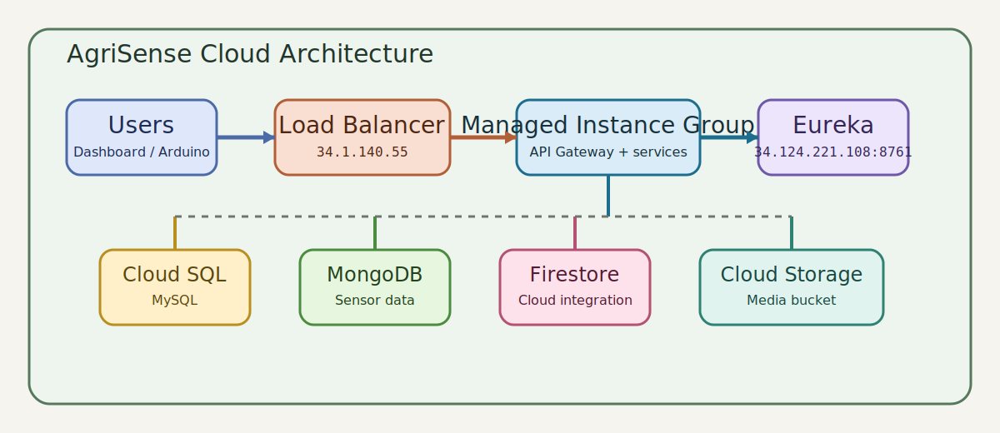
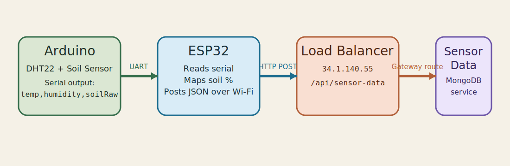

# AgriSense Cloud

Enterprise Cloud Architecture final project submission for `ITS 2130`.

AgriSense Cloud is a smart farm monitoring platform built with Spring Boot microservices, Spring Cloud platform components, a React dashboard, Google Cloud infrastructure, and an Arduino + ESP32 sensor ingestion flow.

## Public URLs

- Dashboard: [http://34.124.221.108:4173](http://34.124.221.108:4173)
- Eureka Dashboard: [http://34.124.221.108:8761](http://34.124.221.108:8761)
- Main API Gateway: [http://34.124.221.108:8080](http://34.124.221.108:8080)
- Load Balancer API: [http://34.1.140.55/api/devices](http://34.1.140.55/api/devices)
- Sensor ingest endpoint: [http://34.1.140.55/api/sensor-data](http://34.1.140.55/api/sensor-data)
- Sensor query example: [http://34.1.140.55/api/sensor-data/sensor-01](http://34.1.140.55/api/sensor-data/sensor-01)

## Project Architecture



### Platform services

- `config-server`
- `eureka-server`
- `api-gateway`

### Business microservices

- `device-service` using Cloud SQL MySQL
- `alert-service` using Cloud SQL MySQL
- `media-service` using Cloud SQL MySQL and Google Cloud Storage
- `sensor-data-service` using MongoDB

### Frontend

- `farm-dashboard` built with React and Vite

## Repository Structure

This submission repository follows the required polyrepo structure using Git submodules.

- `config-server`
- `eureka-server`
- `api-gateway`
- `device-service`
- `sensor-data-service`
- `alert-service`
- `media-service`
- `farm-dashboard`
- `config-repo`

Supporting root-level files:

- [`ecosystem.config.js`](/C:/AgriSense%20Cloud/AgriSense%20Cloud/polyrepo-staging/agrisense-cloud-submission/ecosystem.config.js)
- [`DEPLOYMENT.md`](/C:/AgriSense%20Cloud/AgriSense%20Cloud/polyrepo-staging/agrisense-cloud-submission/DEPLOYMENT.md)
- [`ESP32_SENSOR_CLIENT.ino`](/C:/AgriSense%20Cloud/AgriSense%20Cloud/polyrepo-staging/agrisense-cloud-submission/ESP32_SENSOR_CLIENT.ino)
- [`ARDUINO_SENSOR_NODE.ino`](/C:/AgriSense%20Cloud/AgriSense%20Cloud/polyrepo-staging/agrisense-cloud-submission/ARDUINO_SENSOR_NODE.ino)
- [`POSTMAN_REFERENCE.md`](/C:/AgriSense%20Cloud/AgriSense%20Cloud/polyrepo-staging/agrisense-cloud-submission/POSTMAN_REFERENCE.md)

## Cloud Resources Used

- Google Compute Engine VM instances
- Managed instance groups
- Instance templates
- Machine images
- Health checks
- Regional external application load balancer
- VPC network and subnets
- Firewall rules
- Cloud Router
- Cloud NAT
- Cloud SQL
- Firestore
- Google Cloud Storage bucket

## Hardware Setup



### Boards and sensors

- Arduino board with DHT22 sensor
- Soil moisture sensor
- ESP32 board

### Hardware data flow

1. Arduino reads temperature, humidity, and raw soil moisture.
2. Arduino sends serial data as `temperature,humidity,soilRaw`.
3. ESP32 reads the serial payload.
4. ESP32 converts soil raw value into percentage.
5. ESP32 sends JSON readings to the public sensor API endpoint through Wi-Fi.

### ESP32 uploader sketch

Stored in:

- [`ESP32_SENSOR_CLIENT.ino`](/C:/AgriSense%20Cloud/AgriSense%20Cloud/polyrepo-staging/agrisense-cloud-submission/ESP32_SENSOR_CLIENT.ino)

Target API:

```text
http://34.1.140.55/api/sensor-data
```

### Arduino sensor node sketch

Stored in:

- [`ARDUINO_SENSOR_NODE.ino`](/C:/AgriSense%20Cloud/AgriSense%20Cloud/polyrepo-staging/agrisense-cloud-submission/ARDUINO_SENSOR_NODE.ino)

## Example API Tests

### Device list

```bash
curl http://34.1.140.55/api/devices
```

### Latest sensor data

```bash
curl http://34.1.140.55/api/sensor-data/sensor-01
```

### Post sensor reading

```bash
curl -X POST http://34.1.140.55/api/sensor-data \
  -H "Content-Type: application/json" \
  -d '{"deviceId":"sensor-01","temperature":29.5,"humidity":68.2,"soilMoisture":41.7}'
```

## Process Management

All applications are managed using PM2 as required by the module guideline.

Useful VM verification command:

```bash
pm2 monit
```

## Media Storage

Media uploads are handled by `media-service` and stored in the Google Cloud Storage bucket:

```text
agrisense-media-warushika-2026
```

## Notes

- The dashboard demonstrates all backend services through the API Gateway.
- Eureka is exposed publicly as required by the assignment.
- The load balancer exposes backend APIs through a managed instance group.
